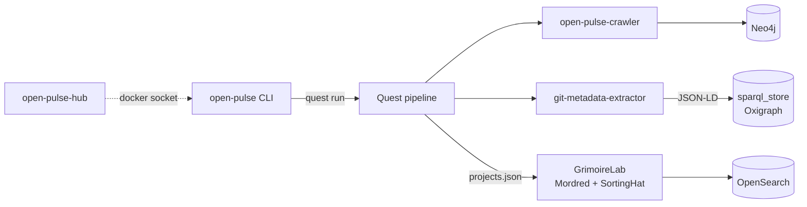

# Architecture

Open Pulse is built around a single unified Python package and a small
set of cooperating services. The pipeline crawls software ecosystems
from GitHub, stores the resulting graph in Neo4j, extracts richer
metadata about each repository, lands that metadata in a SPARQL store,
and feeds development-activity signals into a GrimoireLab + OpenSearch
stack for CHAOSS-style time-series metrics. A FastAPI hub stitches
operations together for humans.

Two query layers expose the data, each tuned for a different shape of
question — see
[Concepts → Graph & Semantic Data](../concepts/graph-and-semantic-data.md)
for the Neo4j ↔ SPARQL split, and
[Concepts → Metrics & CHAOSS](../concepts/metrics-and-chaoss.md) for
the GrimoireLab side.

## Repository boundaries

- `src/open_pulse/` — CLI and runtime code (src-layout, hatchling-built,
  `uv`-managed, Python ≥ 3.11).
- `infra/open-pulse-stack/` — the Open Pulse stack:
  - `docker-compose.yml` (main)
  - `docker-compose.cli.yml` (CLI orchestrator overlay)
  - `docker-compose.grimoirelab.yml` (full GrimoireLab — opt-in via
    `--with-grimoire`)
  - `grimoirelab/` — GrimoireLab supporting assets (applier source,
    sigils, scripts)
- `infra/services/` — single-service deployment references (neo4j,
  oxigraph, sparql-proxy, portainer, …).
- `tools/images/Dockerfile-open-pulse` — the unified image.
- `data/` — bind-mount root for all stateful service data.

## The unified image

One image (`tools/images/Dockerfile-open-pulse` →
`ghcr.io/sdsc-ordes/open-pulse:latest`, override with `OPEN_PULSE_IMAGE`)
plays three roles:

- **Host install.** `pip install` / `uv` run gives you the `open-pulse`
  CLI directly on the host (still uses Docker for the stack itself).
- **`open-pulse-cli` orchestrator.** `entrypoint: ["sleep", "infinity"]`
  in the cli overlay. `scripts/op` does `docker exec` into it, so nested
  `docker compose` and `op` invocations resolve bind paths identically
  to the host (the host repo is bind-mounted at the same absolute path
  inside the container). The `OPEN_PULSE_RUNNING_IN_CLI_CONTAINER=1`
  marker tells the deploy CLI to auto-include the cli overlay.
- **`open-pulse-hub` dashboard.** `command: ["gui","hub","serve",…]`.
  FastAPI control plane: query consoles, CHAOSS metrics, knowledge
  graph, quests, stack control — see [The Hub](../hub/index.md).
  Mounts `/var/run/docker.sock` to talk to the daemon.

## CLI command groups

`src/open_pulse/cli.py` mounts five Typer command groups:

- `deploy` — Docker Compose orchestration (auto-detects when running
  inside the cli container; supports `--with-cli` and `--with-grimoire`
  overlay flags).
- `quest` — Quest pipeline execution (`start`, `run-step`,
  `list-steps`).
- `services` — Service-oriented commands, including the
  `services grimoire {prepare-config,apply,install-watcher}` family.
- `gui` — Interactive UIs: Streamlit (`gui grimoire`) and the FastAPI
  hub (`gui hub serve`).
- `health` — Docker reachability + container status + endpoint probes +
  smoke tests.

## Service container lifecycle

The `open_pulse.services` layer owns all service clients, default
endpoints, and health probes. Each quest run builds a run-scoped
`ServiceContainer` from the quest's `services:` block; the container is
injected into step context as `context["services"]` and disposed via
`close_all()` (or the `__exit__` of a `with` block) on completion.

This keeps connection logic centralized — see the
[Quest Pipeline](../pipeline/index.md) page for the module list and
configuration contract.

## Quest pipeline execution flow

1. Load and validate quest config (`pipeline/config.py`, Pydantic).
2. Build run-scoped `ServiceContainer` from `quest.services`.
3. Wrap enabled steps with `quest.retry` policy.
4. Run sequentially in order: `crawler` → `frontier_extend` →
   `neo4j_upload` → `metadata_extractor` → `sparql_upload` →
   `apply_grimoire_projects` → `archive_outputs`
   (`frontier_extend` and the last two are off by default).
5. Pass shared context to each step, including `context["services"]`.
6. Persist progress to `.quest-checkpoints/<quest-name>.json` for
   checkpoint/resume.
7. Close all services at the end (success or failure).

## Health execution flow

1. Check Docker daemon reachability.
2. Read container status from `docker compose ps`.
3. Probe endpoints through `open_pulse.services.health`.
4. Run smoke tests.
5. Exit non-zero if any check fails.
