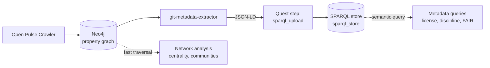
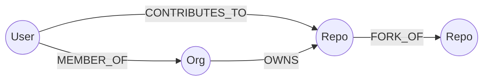

# Graph & Semantic Data

Open Pulse stores its data in two complementary layers, each tuned for a
different kind of question:

- **Neo4j property graph** — fast traversal of the collaboration
  network. Users, repositories and organizations connected by
  contribution, ownership, membership and fork links.
- **SPARQL store** (`sparql_store` — typically Oxigraph, but any
  SPARQL 1.1 + Graph Store HTTP Protocol backend works) — semantically
  rich metadata about each repository, person and organization, modelled
  with [the Open Pulse vocabulary](metadata-and-ontology.md).

Both layers are produced by the same pipeline; the two run in parallel
so the right shape of question can hit the right backend.



## Neo4j: the community network

### Schema



Three node labels and four relationship types. Property keys on the
nodes:

| Label  | Properties                                                                   |
| ------ | ---------------------------------------------------------------------------- |
| `Repo` | `id`, `name`, `full_name`, `owner`, `is_explored`, `exploration_timestamp`   |
| `User` | `id`, `login`, `name`, `type`, `is_explored`, `exploration_timestamp`        |
| `Org`  | `id`, `login`, `name`, `type`, `is_explored`, `exploration_timestamp`        |

### Cypher examples

Each snippet below runs against the live Neo4j instance
(`bolt://localhost:7504` from the host, `bolt://neo4j:7687` inside the
stack).

**Top contributors by repository breadth.**

```cypher
MATCH (u:User)-[:CONTRIBUTES_TO]->(r:Repo)
RETURN u.login AS user, count(r) AS repos
ORDER BY repos DESC
LIMIT 10
```

**All repositories an organization owns.**

```cypher
MATCH (o:Org {login: "sdsc-ordes"})-[:OWNS]->(r:Repo)
RETURN r.full_name AS repo
ORDER BY repo
```

**Find users who contribute to two specific repos (co-contributors).**

```cypher
MATCH (u:User)-[:CONTRIBUTES_TO]->(r1:Repo {full_name: "sdsc-ordes/gimie"}),
      (u)-[:CONTRIBUTES_TO]->(r2:Repo)
WHERE r2.full_name <> r1.full_name
RETURN u.login AS user, collect(DISTINCT r2.full_name) AS also_contributes_to
ORDER BY size(also_contributes_to) DESC
LIMIT 10
```

**Repositories with the most forks in the store.**

```cypher
MATCH (fork:Repo)-[:FORK_OF]->(parent:Repo)
RETURN parent.full_name AS repo, count(fork) AS forks
ORDER BY forks DESC
LIMIT 10
```

**Shortest collaboration path between two users.**

```cypher
MATCH p = shortestPath(
  (a:User {login: "caviri"})-[:CONTRIBUTES_TO|:MEMBER_OF*..6]-(b:User {login: "cmdoret"})
)
RETURN [n IN nodes(p) | coalesce(n.login, n.full_name)] AS hops
```

### Neo4j Browser

A graphical Cypher console is available at
[http://localhost:7503](http://localhost:7503). Authentication uses the
`NEO4J_AUTH` credentials from `infra/.env` (default user: `neo4j`).

## SPARQL store: semantic queries

The same entities exist in the SPARQL store as RDF resources, modelled
with a small custom vocabulary plus schema.org and the W3C Organization
and Time ontologies. See
[Metadata & Ontology](metadata-and-ontology.md) for the vocabulary
reference and SPARQL examples.

### When to use which layer

| Question shape                                          | Best layer            |
| ------------------------------------------------------- | --------------------- |
| "Shortest path between two contributors"                | Neo4j (graph algos)   |
| "Centrality / community detection / PageRank"           | Neo4j + GDS plugin    |
| "Which repos are MIT-licensed and written in Python?"   | SPARQL store          |
| "All people whose membership in `sdsc-ordes` is still open" | SPARQL store      |
| "Repositories enriched with linked external IDs (ORCID, …)" | SPARQL store      |
| "Aggregate contribution counts per discipline"          | SPARQL store          |

The same repository appears in both layers: a `Repo` node in Neo4j
(identified by `full_name`) maps to a `schema:SoftwareSourceCode`
resource in the SPARQL store (identified by
`op:githubRepositoryHandle`).

## Cross-layer joins from Python

Pipeline steps and notebooks talk to both layers through the
[Services](../services/index.md) container. Outside the pipeline, the
two endpoints can be queried side-by-side from a notebook:

```python
from neo4j import GraphDatabase
from SPARQLWrapper import SPARQLWrapper, JSON

neo = GraphDatabase.driver("bolt://localhost:7504", auth=("neo4j", "<password>"))
sparql = SPARQLWrapper("http://localhost:7502/query")
sparql.setReturnFormat(JSON)

# 1. Graph traversal in Neo4j
with neo.session() as s:
    repos = [r["full_name"] for r in s.run(
        "MATCH (:Org {login: 'sdsc-ordes'})-[:OWNS]->(r:Repo) RETURN r.full_name AS full_name"
    )]

# 2. Enrich with semantic metadata from the SPARQL store
values = " ".join(f'"{h}"' for h in repos)
sparql.setQuery(f"""
  PREFIX op:     <https://open-pulse.epfl.ch/ontology#>
  PREFIX schema: <http://schema.org/>
  SELECT ?handle ?license ?language WHERE {{
    VALUES ?handle {{ {values} }}
    ?repo op:githubRepositoryHandle ?handle .
    OPTIONAL {{ ?repo schema:license ?license }}
    OPTIONAL {{ ?repo schema:programmingLanguage ?language }}
  }}
""")
rows = sparql.query().convert()["results"]["bindings"]
```

## Where each backend runs

| Service        | Inside the stack                        | From the host                      |
| -------------- | --------------------------------------- | ---------------------------------- |
| Neo4j Bolt     | `bolt://neo4j:7687`                     | `bolt://localhost:7504`            |
| Neo4j Browser  | `http://neo4j:7474`                     | `http://localhost:7503`            |
| SPARQL endpoint| `http://sparql-proxy:7878/query`        | `http://localhost:7502/query`      |

Host ports can shift if you customise `infra/.env` — `op deploy ps`
shows the live mapping.
