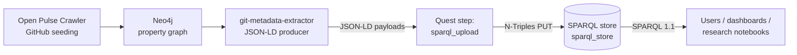

# Metadata & Ontology

Open Pulse keeps repository, contributor and organization metadata in a
SPARQL 1.1 store, modelled with a small custom vocabulary that re-uses
[schema.org](https://schema.org/), the
[W3C Organization Ontology](https://www.w3.org/TR/vocab-org/) and the
[W3C Time Ontology](https://www.w3.org/TR/owl-time/). Anything that
speaks the SPARQL 1.1 Graph Store HTTP Protocol can host the data; the
default deployment runs Oxigraph behind an nginx proxy
([sparql-proxy](../services/index.md)) at
`http://sparql-proxy:7878` inside the stack and `http://localhost:7502`
on the host.

The legacy "Tentris RDF Store" name is gone — the service is now called
`sparql_store` (see [Services](../services/index.md)) and is
backend-agnostic.

## Vocabulary

The store mixes four namespaces:

| Prefix   | IRI                                          | Used for                                            |
| -------- | -------------------------------------------- | --------------------------------------------------- |
| `op:`    | `https://open-pulse.epfl.ch/ontology#`       | Open Pulse–specific terms (Contribution, GitHub IDs)|
| `schema:`| `http://schema.org/`                         | Person, SoftwareSourceCode, ScholarlyArticle, author, name, license, programmingLanguage |
| `org:`   | `http://www.w3.org/ns/org#`                  | Organization, Membership, role                      |
| `time:`  | `http://www.w3.org/2006/time#`               | Membership intervals (`hasBeginning`, `hasEnd`)     |

### Classes

The classes actually present in the default stack (numbers from a live
deployment):

| Class                        | Approx count | Role                                  |
| ---------------------------- | ------------:| ------------------------------------- |
| `op:Contribution`            |        3,494 | A user's aggregate contribution to a repo (count + first/last date) |
| `schema:Person`              |        2,890 | A contributor (GitHub user or ORCID)  |
| `org:Membership`             |        1,462 | A user's membership in an organization (with time interval) |
| `org:Organization`           |        1,024 | A GitHub organization or institution  |
| `schema:SoftwareSourceCode`  |          565 | A repository                          |
| `schema:ScholarlyArticle`    |            2 | Linked publication (when present)     |

### Property cheat sheet

The most frequent predicates in the store, grouped by what they describe:

**Repositories (`schema:SoftwareSourceCode`)**
- `op:githubRepositoryHandle` — `"owner/repo"`
- `op:githubRepoStars`, `op:githubRepoForks`
- `op:repositoryType`, `op:discipline`
- `op:ownedBy` → `org:Organization`
- `schema:url`, `schema:name`, `schema:dateCreated`
- `schema:programmingLanguage`, `schema:license`

**People (`schema:Person`)**
- `op:githubUsername`
- `op:orcidIdentifier`
- `schema:name`, `schema:email`, `schema:url`
- `op:hasContribution` → `op:Contribution`
- `org:hasMembership` → `org:Membership`

**Contributions (`op:Contribution`)**
- `op:contributionTo` → `schema:SoftwareSourceCode`
- `op:contributionCount`
- `op:firstContributionDate`, `op:lastContributionDate`

**Organizations (`org:Organization`)**
- `op:githubOrganizationHandle`
- `op:owns` → `schema:SoftwareSourceCode`
- `op:OrganizationType`

## Example queries

All snippets below run against the live SPARQL endpoint at
`http://localhost:7502/query` and return data on a typical deployment.

### Top-starred repositories

```sparql
PREFIX op:     <https://open-pulse.epfl.ch/ontology#>
PREFIX schema: <http://schema.org/>

SELECT ?handle ?stars ?language WHERE {
  ?repo a schema:SoftwareSourceCode ;
        op:githubRepositoryHandle ?handle ;
        op:githubRepoStars ?stars .
  OPTIONAL { ?repo schema:programmingLanguage ?language }
}
ORDER BY DESC(?stars)
LIMIT 10
```

### Most active contributors

```sparql
PREFIX op:     <https://open-pulse.epfl.ch/ontology#>
PREFIX schema: <http://schema.org/>

SELECT ?username (SUM(?count) AS ?total) WHERE {
  ?user a schema:Person ;
        op:githubUsername ?username ;
        op:hasContribution ?c .
  ?c op:contributionCount ?count .
}
GROUP BY ?username
ORDER BY DESC(?total)
LIMIT 10
```

### Repositories owned by an organization, with their license

```sparql
PREFIX op:     <https://open-pulse.epfl.ch/ontology#>
PREFIX schema: <http://schema.org/>

SELECT ?handle ?license WHERE {
  ?org op:githubOrganizationHandle "sdsc-ordes" ;
       op:owns ?repo .
  ?repo op:githubRepositoryHandle ?handle .
  OPTIONAL { ?repo schema:license ?license }
}
ORDER BY ?handle
```

### Memberships that are still open (no `hasEnd`)

```sparql
PREFIX org:  <http://www.w3.org/ns/org#>
PREFIX time: <http://www.w3.org/2006/time#>
PREFIX op:   <https://open-pulse.epfl.ch/ontology#>

SELECT ?username ?orgHandle WHERE {
  ?user org:hasMembership ?m ;
        op:githubUsername ?username .
  ?m org:organization ?org .
  ?org op:githubOrganizationHandle ?orgHandle .
  FILTER NOT EXISTS { ?m time:hasEnd ?end }
}
LIMIT 20
```

## Data flow

Metadata reaches the store through two extractor paths and a quest step
that loads the resulting JSON-LD over the
[SPARQL 1.1 Graph Store Protocol](https://www.w3.org/TR/sparql11-http-rdf-update/):



The pipeline is sequential and orchestrated by `open-pulse quest run`
([Architecture](../architecture/index.md)).

## The metadata extractor

The extractor (image
[`ghcr.io/imaging-plaza/git-metadata-extractor`](https://github.com/imaging-plaza/git-metadata-extractor),
v3.0.0 at time of writing) is a FastAPI service that combines two
strategies for any given repository:

- **`gimie`** — rule-based extraction using the
  [Gimie](https://github.com/sdsc-ordes/gimie) library (v0.7.2).
  Deterministic, fast.
- **LLM-assisted** — augments fields a rule-based pass cannot infer
  (e.g. discipline, repository type). Powered by a configurable
  OpenAI-compatible endpoint.

### v2 API (current)

`POST /v2/extract` enqueues an async job and returns `202 Accepted`
with a job id. Poll `GET /v2/jobs/{job_id}` for status.

```bash
curl -s -X POST http://localhost:1234/v2/extract \
  -H "Content-Type: application/json" \
  -d '{
        "source_url": "https://github.com/sdsc-ordes/gimie",
        "output_format": "json-ld",
        "agent_runtime": "auto",
        "include_context_summary": false
      }'
```

Health: `GET /v2/health` returns `{"status": "healthy", ...}` with token
budgets when the GitHub token pool is healthy.

### Pipeline integration

The `metadata_extractor` service client in `open_pulse.services` is the
one the quest pipeline uses — see
[Services](../services/index.md) for the configuration contract.

## Where to query

| Surface              | Inside the stack                         | From the host                |
| -------------------- | ---------------------------------------- | ---------------------------- |
| SPARQL query (read)  | `http://sparql-proxy:7878/query`         | `http://localhost:7502/query`|
| SPARQL update (write) — auth required | `http://sparql-proxy:7878/update`        | `http://localhost:7502/update`|
| Graph store (PUT/POST/DELETE) | `http://sparql-proxy:7878/store` | `http://localhost:7502/store`|

Writes require HTTP Basic auth read from `SPARQL_AUTH`; reads do not.
The
[`sparql_store` service client](../services/index.md) wraps the upload
path used by the quest pipeline.
