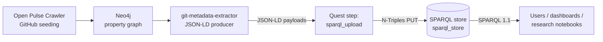

# Metadata & Ontology

Open Pulse keeps repository, contributor and organization metadata in a
SPARQL 1.1 store, modelled with a small custom vocabulary that re-uses
[schema.org](https://schema.org/), the
[W3C Organization Ontology](https://www.w3.org/TR/vocab-org/) and the
[W3C Time Ontology](https://www.w3.org/TR/owl-time/). Anything that
speaks the SPARQL 1.1 Graph Store HTTP Protocol can host the data; the
default deployment runs Oxigraph behind a Caddy proxy (`sparql-proxy`)
at `http://sparql-proxy:7878` inside the stack and
`http://localhost:7502` on the host.

## Vocabulary

The store mixes five namespaces:

| Prefix   | IRI                                          | Used for                                            |
| -------- | -------------------------------------------- | --------------------------------------------------- |
| `op:`    | `https://open-pulse.epfl.ch/ontology#`       | Open Pulse–specific terms (Contribution, GitHub IDs)|
| `schema:`| `http://schema.org/`                         | Person, SoftwareSourceCode, ScholarlyArticle, author, name, license, programmingLanguage |
| `org:`   | `http://www.w3.org/ns/org#`                  | Organization, Membership, role                      |
| `time:`  | `http://www.w3.org/2006/time#`               | Membership intervals (`hasBeginning`, `hasEnd`)     |
| `gme:`   | `https://openpulse.science/git-metadata-extractor#` | Extractor-internal signals auto-promoted to triples (`gme:ror_country`, `gme:followers_count`, `gme:github_updated_at`, release / CI / test-coverage fields, …). Outside the formal ontology but heavily used by the Hub's CHAOSS metrics. |

### Classes

The classes present in a deployed stack (instance counts depend
entirely on what each node has crawled — query your own with the
snippet below):

| Class                        | Role                                  |
| ---------------------------- | ------------------------------------- |
| `op:Contribution`            | A user's aggregate contribution to a repo (count + first/last date) |
| `schema:Person`              | A contributor (GitHub user or ORCID)  |
| `schema:SoftwareSourceCode`  | A repository                          |
| `org:Membership`             | A user's membership in an organization (with time interval) |
| `org:Organization`           | A GitHub organization or institution  |
| `schema:ScholarlyArticle`    | Linked publication (when present)     |

```sparql
SELECT ?class (COUNT(?s) AS ?instances)
WHERE { ?s a ?class }
GROUP BY ?class ORDER BY DESC(?instances)
```

### Property cheat sheet

The most frequent predicates in the store, grouped by what they describe:

**Repositories (`schema:SoftwareSourceCode`)**
- `op:githubRepositoryHandle` — `"owner/repo"`
- `op:githubRepoStars`, `op:githubRepoForks`
- `op:repositoryType`, `op:discipline`
- `op:ownedBy` → `org:Organization`
- `schema:url`, `schema:name`, `schema:dateCreated`
- `schema:programmingLanguage`, `schema:license`

**People (`schema:Person`)**
- `op:githubUsername`
- `op:orcidIdentifier`
- `schema:name`, `schema:email`, `schema:url`
- `op:hasContribution` → `op:Contribution`
- `org:hasMembership` → `org:Membership`

**Contributions (`op:Contribution`)**
- `op:contributionTo` → `schema:SoftwareSourceCode`
- `op:contributionCount`
- `op:firstContributionDate`, `op:lastContributionDate`

**Organizations (`org:Organization`)**
- `op:githubOrganizationHandle`
- `op:owns` → `schema:SoftwareSourceCode`
- `op:OrganizationType`

## Example queries

All snippets below run against the live SPARQL endpoint at
`http://localhost:7502/query` and return data on a typical deployment.

### Top-starred repositories

```sparql
PREFIX op:     <https://open-pulse.epfl.ch/ontology#>
PREFIX schema: <http://schema.org/>

SELECT ?handle ?stars ?language WHERE {
  ?repo a schema:SoftwareSourceCode ;
        op:githubRepositoryHandle ?handle ;
        op:githubRepoStars ?stars .
  OPTIONAL { ?repo schema:programmingLanguage ?language }
}
ORDER BY DESC(?stars)
LIMIT 10
```

### Most active contributors

```sparql
PREFIX op:     <https://open-pulse.epfl.ch/ontology#>
PREFIX schema: <http://schema.org/>

SELECT ?username (SUM(?count) AS ?total) WHERE {
  ?user a schema:Person ;
        op:githubUsername ?username ;
        op:hasContribution ?c .
  ?c op:contributionCount ?count .
}
GROUP BY ?username
ORDER BY DESC(?total)
LIMIT 10
```

### Repositories owned by an organization, with their license

```sparql
PREFIX op:     <https://open-pulse.epfl.ch/ontology#>
PREFIX schema: <http://schema.org/>

SELECT ?handle ?license WHERE {
  ?org op:githubOrganizationHandle "sdsc-ordes" ;
       op:owns ?repo .
  ?repo op:githubRepositoryHandle ?handle .
  OPTIONAL { ?repo schema:license ?license }
}
ORDER BY ?handle
```

### Memberships that are still open (no `hasEnd`)

```sparql
PREFIX org:  <http://www.w3.org/ns/org#>
PREFIX time: <http://www.w3.org/2006/time#>
PREFIX op:   <https://open-pulse.epfl.ch/ontology#>

SELECT ?username ?orgHandle WHERE {
  ?user org:hasMembership ?m ;
        op:githubUsername ?username .
  ?m org:organization ?org .
  ?org op:githubOrganizationHandle ?orgHandle .
  FILTER NOT EXISTS { ?m time:hasEnd ?end }
}
LIMIT 20
```

## Data flow

Metadata reaches the store through two extractor paths and a quest step
that loads the resulting JSON-LD over the
[SPARQL 1.1 Graph Store Protocol](https://www.w3.org/TR/sparql11-http-rdf-update/):



The pipeline is sequential and orchestrated by `open-pulse quest start`
(see [Quest Pipeline](../pipeline/index.md)).

## Named graphs

Quest uploads land in **monthly named graphs** following the pattern
`{base}/{YYYY-MM}/{runtime}` — e.g.
`https://open-pulse.epfl.ch/graph/2026-06/hybrid` — derived
automatically from the run date and the extractor's agent runtime
(`hybrid` or `rule-based`). Hybrid graphs are additionally mirrored
into the default graph, so unscoped queries always see the canonical
data. Query a specific snapshot with `GRAPH <iri> { … }`, or
enumerate them:

```sparql
SELECT ?g (COUNT(*) AS ?triples)
WHERE { GRAPH ?g { ?s ?p ?o } }
GROUP BY ?g ORDER BY DESC(?triples)
```

## The metadata extractor

The extractor (image
[`ghcr.io/imaging-plaza/git-metadata-extractor`](https://github.com/imaging-plaza/git-metadata-extractor))
is a FastAPI service that combines two strategies for any given
repository:

- **Rule-based** — deterministic extraction from the repository and
  the GitHub API. Gimie (JSON-LD) extraction is provided by the
  `gme-gimie-api` sidecar container rather than in-process.
- **LLM-assisted** (`hybrid` runtime) — augments fields a rule-based
  pass cannot infer (e.g. discipline, repository type). Powered by a
  configurable OpenAI-compatible endpoint.

### v2 API (current)

`POST /v2/extract` enqueues an async job and returns `202 Accepted`
with a job id. Poll `GET /v2/jobs/{job_id}` for status.

```bash
curl -s -X POST http://localhost:1234/v2/extract \
  -H "Content-Type: application/json" \
  -d '{
        "source_url": "https://github.com/sdsc-ordes/gimie",
        "output_format": "json-ld",
        "agent_runtime": "hybrid",
        "include_context_summary": false
      }'
```

Health: `GET /v2/health` returns `{"status": "healthy", ...}` with token
budgets when the GitHub token pool is healthy.

### Pipeline integration

The `metadata_extractor` service client in `open_pulse.services` is the
one the quest pipeline uses — see
[Quest Pipeline](../pipeline/index.md) for the configuration contract.

## Where to query

| Surface              | Inside the stack                         | From the host                |
| -------------------- | ---------------------------------------- | ---------------------------- |
| SPARQL query (read)  | `http://sparql-proxy:7878/query`         | `http://localhost:7502/query`|
| SPARQL update (write) — auth required | `http://sparql-proxy:7878/update`        | `http://localhost:7502/update`|
| Graph store (PUT/POST/DELETE) | `http://sparql-proxy:7878/store` | `http://localhost:7502/store`|

Both reads and writes require HTTP Basic auth with the `SPARQL_AUTH`
credentials by default (`SPARQL_READ_AUTH_PATHS` in `infra/.env`
controls which paths are read-gated; set it to `__off__` for a public
read endpoint). The `sparql_store` service client (see
[Quest Pipeline](../pipeline/index.md)) wraps the upload path used by
the quest pipeline.
